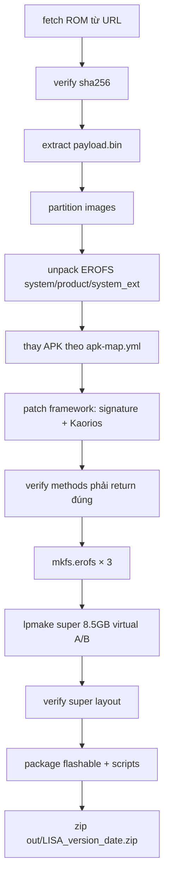

# PIPELINE — Git tự build ROM `lisa` (thiết kế)

Mục tiêu: **1 repo Git** nhận link ROM gốc + APK mod → tự build ROM flashable, không cần thao tác tay.

---

## 1. Kiến trúc tổng

```text
rom-kitchen/
├── .github/workflows/build.yml      # CI (optional): build khi tag/release
├── config/
│   ├── device.yml                   # thông tin máy, partition map, super layout
│   ├── apk-map.yml                  # APK mod → vị trí trong ROM
│   └── patches.yml                  # bật/tắt patch (signature, kaorios, …)
├── scripts/
│   ├── 00-fetch-rom.ps1             # tải ROM từ URL (xiaomirom / mirror)
│   ├── 01-extract-payload.ps1       # payload.bin → images
│   ├── 02-unpack-erofs.ps1          # system/product/system_ext
│   ├── 03-apply-apks.ps1            # thay APK theo apk-map.yml
│   ├── 04-patch-framework.ps1       # bypass chữ ký + Kaorios
│   ├── 05-pack-erofs.ps1            # mkfs.erofs (strip fs_config)
│   ├── 06-pack-super.ps1            # lpmake đúng layout stock
│   ├── 07-package-flash.ps1         # zip flashable + scripts
│   ├── 08-verify.ps1                # checklist tự kiểm tra
│   └── build.ps1                    # chạy full pipeline
├── assets/
│   ├── apks/                        # APK mod (git-lfs hoặc release asset)
│   ├── tools/                       # erofs, lp*, apktool, payload-dumper (hoặc auto-download)
│   └── kaorios/                     # KaoriosToolbox.apk + xml + classes.dex
├── out/
│   └── LISA_<version>_<date>/       # gói flash
├── docs/
│   ├── BUILD_LOG.md                 # log đầy đủ lần build 2026-09-23
│   └── PIPELINE.md                  # file này
├── README.md
└── rom-kitchen.ps1                  # entrypoint: .\rom-kitchen.ps1 build
```

---

## 2. Config mẫu

### `config/device.yml`

```yaml
device:
  codename: lisa
  model: Mi 11 Lite 5G NE
  platform: sm7325
  android: 14

rom:
  # URL ROM gốc (OTA full). Có thể override khi chạy build.
  url: "https://example.com/lisa-ota_full-OS2.0.16.0.UKOCNXM-user-14.0.zip"
  version: OS2.0.16.0.UKOCNXM
  region: cn
  sha256: ""          # nên điền để verify

payload:
  file: payload.bin
  partitions:
    erofs: [system, product, system_ext, vendor, odm, mi_ext]
    firmware: [abl, aop, bluetooth, boot, cpucp, devcfg, dsp, dtbo,
               featenabler, hyp, imagefv, keymaster, modem, qupfw,
               shrm, tz, uefisecapp, vbmeta, vbmeta_system,
               vendor_boot, xbl, xbl_config]

super:
  # BẮT BUỘC khớp partition super của máy
  device_size: 9126805504        # 8.5 GiB
  metadata_size: 65536
  metadata_slots: 3
  virtual_ab: true
  super_name: super
  groups:
    qti_dynamic_partitions_a: 9126805504
    qti_dynamic_partitions_b: 9126805504
  # slot A chứa data, slot B size 0 (virtual A/B)
  partitions:
    system:     { size: 720371712 }
    system_ext: { size: 591396864 }
    product:    { size: 4322230272 }
    vendor:     { size: 1553989632 }
    odm:        { size: 34603008 }
    mi_ext:     { size: 17825792 }

flash:
  vbmeta_flags: "--disable-verity --disable-verification"
  format_data: true
```

### `config/apk-map.yml`

```yaml
# src = đường dẫn trong assets/apks/ (hoặc path tuyệt đối)
# dst = path trong partition image (không có prefix partition)
# partition = product | system | system_ext
# remove_oat = true → xoá oat/ cạnh APK sau khi thay

apks:
  - src: MiuiHome.apk
    partition: product
    dst: priv-app/MiuiHome/MiuiHome.apk
    remove_oat: true

  - src: SecurityMod_v13.5.3_PeaceModss.apk
    partition: product
    dst: priv-app/MIUISecurityCenter/MIUISecurityCenter.apk
    remove_oat: true

  - src: JoyoseMod_v2.5.20_PeaceModss.apk
    partition: product
    dst: pangu/system/app/Joyose/Joyose.apk
    remove_oat: true

  - src: "[LLions] HyperOS File Manager Mod v9.2.3.2.apk"
    partition: product
    dst: app/MIUIFileExplorer/MIUIFileExplorer.apk
    remove_oat: true

  - src: "[LLions] HyperOS Gallery Mod v4.3.1.16.apk"
    partition: product
    dst: priv-app/MIUIGallery/MIUIGallery.apk
    remove_oat: true

  - src: "[LLions] HyperOS Gallery Editor Mod v2.10.39.3.apk"
    partition: product
    dst: data-app/MIMediaEditor/MIMediaEditor.apk
    remove_oat: true

  - src: "[LLions] HyperOS Recorder Mod v8.1.4.apk"
    partition: product
    dst: data-app/MIUISoundRecorderTargetSdk30/MIUISoundRecorderTargetSdk30.apk
    remove_oat: true

  - src: "[LLions] HyperOS AI Engine Mod v4.11.28.apk"
    partition: product
    dst: app/AiasstVision/AiasstVision.apk
    remove_oat: true

  # ⚠️ map suy đoán — cần verify trên máy
  - src: "[LLions] HyperOS Bokeh Mod v2.2.1.0.1.apk"
    partition: product
    dst: priv-app/MiuiExtraPhoto/MiuiExtraPhoto.apk
    remove_oat: true
    note: "verify lại package name / vị trí"

# Kaorios (không root)
kaorios:
  apk: KaoriosToolbox.apk
  apk_dst: priv-app/KaoriosToolbox/KaoriosToolbox.apk
  libs_from: kaorios_libs/          # optional native libs
  permission_xml:
    - com.kousei.kaorios.xml
    - privapp_whitelist_com.kousei.kaorios.xml
  permission_dst: etc/permissions/
  build_props:
    persist.sys.kaorios: kousei
    ro.control_privapp_permissions: ""
```

### `config/patches.yml`

```yaml
signature_bypass: true
kaorios: true
cn_notification_fix: false
disable_secure_flag: false

# Method bắt buộc phải return đúng giá trị (verify sau build)
must_pass:
  framework:
    - method: getMinimumSignatureSchemeVersionForTargetSdk
      return: 0
    - method: checkCapability
      return: 1
    - method: checkCapabilityRecover
      return: 1
    - method: verifyMessageDigest
      return: 1
    - method: isPackageWhitelistedForHiddenApis
      return: 1
  services:
    - method: verifySignatures
      return: 0
    - method: matchSignaturesCompat
      return: 1
    - method: checkDowngrade
      return: void
    - method: shouldCheckUpgradeKeySetLocked
      return: 0
```

---

## 3. Flow build (1 lệnh)

```powershell
.\rom-kitchen.ps1 build `
    -RomUrl   "https://…/lisa-ota_full-OS2.0.16.0.UKOCNXM-….zip" `
    -ApkDir   "D:\LISA\APk" `
    -OutDir   "out"
```



---

## 4. Script chính (`scripts/build.ps1`) — sketch

```powershell
param(
  [string]$RomUrl,
  [string]$ApkDir = "assets\apks",
  [string]$ConfigDir = "config",
  [string]$OutDir = "out",
  [switch]$SkipFetch
)

$ErrorActionPreference = "Stop"
$root = Split-Path $PSScriptRoot -Parent

# Load config (ConvertFrom-Yaml hoặc JSON fallback)
$device = Get-Content "$ConfigDir\device.yml" -Raw | ConvertFrom-Yaml
$apkMap = Get-Content "$ConfigDir\apk-map.yml" -Raw | ConvertFrom-Yaml
$patches = Get-Content "$ConfigDir\patches.yml" -Raw | ConvertFrom-Yaml

# 00 fetch
if (-not $SkipFetch) {
  & "$PSScriptRoot\00-fetch-rom.ps1" -Url $RomUrl -Out "$root\cache\rom.zip" -Sha256 $device.rom.sha256
}

# 01 payload
& "$PSScriptRoot\01-extract-payload.ps1" -OtaZip "$root\cache\rom.zip" -Out "$root\cache\images"

# 02 unpack
foreach ($p in $device.payload.partitions.erofs) {
  & "$PSScriptRoot\02-unpack-erofs.ps1" -Image "$root\cache\images\$p.img" -Out "$root\work\$p"
}

# 03 apks
& "$PSScriptRoot\03-apply-apks.ps1" -Map $apkMap.apks -ApkDir $ApkDir -Work "$root\work"

# 04 framework
if ($patches.signature_bypass -or $patches.kaorios) {
  & "$PSScriptRoot\04-patch-framework.ps1" -Work "$root\work" -Patches $patches -Kaorios $apkMap.kaorios
}

# 05 erofs
foreach ($p in $device.payload.partitions.erofs) {
  if ($p -in @('system','product','system_ext')) {
    & "$PSScriptRoot\05-pack-erofs.ps1" -Part $p -Work "$root\work\$p" -Out "$root\cache\images\$p.img"
  }
}

# 06 super
& "$PSScriptRoot\06-pack-super.ps1" -Cfg $device.super -Images "$root\cache\images" -Out "$root\cache\super.img"

# 07 package
$name = "LISA_$($device.rom.version)_$(Get-Date -Format yyyyMMdd)"
& "$PSScriptRoot\07-package-flash.ps1" -Name $name -Images "$root\cache\images" -Super "$root\cache\super.img" -Out "$OutDir\$name"

# 08 verify
& "$PSScriptRoot\08-verify.ps1" -Package "$OutDir\$name" -MustPass $patches.must_pass
Write-Host "DONE: $OutDir\$name" -ForegroundColor Green
```

---

## 5. Verify bắt buộc (`08-verify.ps1`)

| Check | Pass condition |
|---|---|
| super size | == `device.super.device_size` |
| super metadata | version 10.2, slots 3, flag `virtual_ab_device` |
| super partitions | đủ `_a` + `_b`, block name `super` |
| framework.jar | có string `kaorios`, method `must_pass` return đúng |
| services.jar | method `must_pass` return đúng |
| APK map | mọi `dst` tồn tại trong partition tree |
| oat cleaned | không còn `.odex/.vdex` cạnh APK đã thay |
| vbmeta script | có `--disable-verity --disable-verification` |
| flash scripts | tồn tại `flash_format_data.bat` |

Nếu fail → **không cho ra package**.

---

## 6. An toàn máy (không được quên)

1. **ARB / anti-rollback** — không flash ROM có index ARB < ROM đang chạy.
2. **Backup EFS/NVRAM** trước khi format data.
3. **vbmeta** phải disable verity/verification khi system đã patch.
4. **super size + virtual A/B** phải **khớp stock** — lệch là bootloop / flash fail.
5. **oat/odex** APK cũ phải xoá khi thay APK.
6. **PowerShell wildcard** `[LLions]` → luôn `-LiteralPath`.
7. **Bootloop cứu máy:** flash lại stock OTA bằng Mi Flash `flash_all`.

---

## 7. Mở rộng sau này

| Việc | Cách |
|---|---|
| Thêm APK mod mới | thêm dòng vào `apk-map.yml` |
| Cập nhật Kaorios | thay `assets/kaorios/*` |
| ROM version mới | đổi `device.yml` / truyền `-RomUrl` |
| Tự build trên CI | GitHub Actions: cache tool, artifact = zip flash |
| Multi-device | clone `device.yml` theo codename (spes, moonstone, …) |
| App mod khác chữ ký sau flash | `adb install -r -d` (không cần build lại) |

---

## 8. Tool auto-download (`00-tools.ps1`)

Nếu `assets/tools` trống thì tải:

| Tool | URL |
|---|---|
| payload-dumper-go 2.0.2 | `ssut/payload-dumper-go` release windows_amd64.tar.gz |
| erofs (extract/mkfs) | `littlecoca/erofs_tool_win` |
| lpunpack/lpmake/lpdumps | `Rprop/aosp15_partition_tools` windows_x86 |
| apktool | `iBotPeaches/Apktool` |
| Kaorios | `Wuang26/Kaorios-Toolbox` V2.0.4 |

---

## 9. Lệnh hay dùng

```powershell
# Full build
.\rom-kitchen.ps1 build -RomUrl $env:ROM_URL

# Chỉ đóng gói lại sau khi sửa APK
.\rom-kitchen.ps1 pack-only

# Chỉ verify package đã có
.\rom-kitchen.ps1 verify -Package out\LISA_...

# In super layout (debug)
& tools\lpdumps.exe out\...\images\super.img
```
